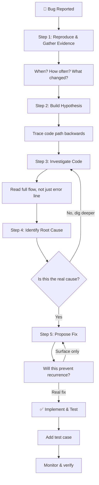
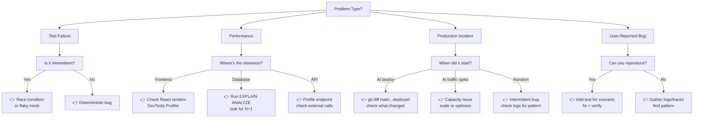

# Root Cause Analysis (RCA)

Don't guess. Investigate systematically.

This skill analyzes bugs, test failures, performance regressions, and production incidents to find the **root cause**, not just the symptom. It then proposes targeted fixes that prevent the problem from recurring.

## Core Principle

Most bugs are symptoms of a deeper problem. A quick fix silences the symptom; RCA finds and fixes the root.

### Symptom vs. Root

**Symptom (❌ surface level):**
```
- User can't log in
- Test fails intermittently
- API returns 500 error
- Page loads slowly
```

**Root Cause (✅ deep):**
```
- Session token refresh silently fails when Redis is down (no retry logic)
- Race condition in database query when two requests write simultaneously
- Unhandled Promise rejection in middleware crashes the process
- N+1 query problem: fetching user data in a loop instead of batch
```

### RCA Flow Diagram



## How It Works

### Step 1: Reproduce & Gather Evidence

**What we need:**
- Exact error message or observable behavior
- When it started (new feature, version bump, deployment)
- How often it occurs (always, intermittently, under load)
- What changed recently (commits, dependencies, config)
- Stack traces, logs, timing data

**Questions to answer:**
```
Q1: Is this new or did it regress?
Q2: Does it happen in dev, staging, or prod only?
Q3: Can you reproduce it reliably?
Q4: What were the last code changes?
Q5: Are there error logs or monitoring alerts?
```

### Step 2: Build a Hypothesis

Trace the failure backwards through the code:

```
User sees: "Login failed"
  ↓ What code path handles login?
    → /apps/app/actions/auth.ts
  ↓ What can cause it to fail?
    → Network error, invalid credentials, session timeout, token expired
  ↓ Which is most likely?
    → Check logs, timing, frequency
  ↓ Hypothesis: Session refresh fails silently; user redirected to login
```

### Step 3: Investigate the Code

**Read the full flow, not just the error line:**

```
1. Entry point: where the error occurs
2. Function that was called: what does it do?
3. Dependencies it uses: are they reliable?
4. Error handling: what happens on failure?
5. Related code: are there similar patterns elsewhere?
6. Tests: what's covered and what's not?
```

### Step 4: Identify the Root Cause

**Common root causes in our codebase:**

| Pattern | Symptom | Root Cause |
|---------|---------|-----------|
| **Missing error handling** | Silent failure | Server Action doesn't catch thrown error |
| **Race condition** | Intermittent | Unguarded concurrent writes to same resource |
| **N+1 query** | Slow page load | Loop fetching related data instead of JOIN |
| **State mutation** | Unexpected behavior | Component modifies prop or shared state |
| **Missing await** | Promise not resolved | Async function called without `await` |
| **Stale dependency** | Different behavior | Cached data not invalidated on update |
| **Type mismatch** | Type error at runtime | Zod schema doesn't match actual data |
| **Unhandled rejection** | Crash with no error | Promise.catch missing or not awaited |

### Step 5: Propose Fix

**Always ask: "Will this prevent recurrence?"**

```
❌ Bad fix (symptom only):
  Wrap the error in try/catch and show "something went wrong"

✅ Good fix (root cause):
  Add retry logic with exponential backoff for session refresh failures
  Add monitoring to alert on repeated failures
  Add tests for the failure scenario
```

## Investigation Playbook

### Quick Reference: Problem Type Routing



### For Test Failures

```
1. Is it intermittent or always?
   → Intermittent: likely race condition or flaky mock
   → Always: deterministic bug

2. Does it fail in CI only?
   → CI-only: timing, environment variables, or database state
   → Local + CI: real bug

3. When did it start?
   → After commit X: find what changed
   → After dependency update: check what changed
   → Randomly: likely race condition or timing

4. Check:
   → git log --oneline -n 20 <test-file>
   → git show <recent-commit> -- <file>
   → npm test <test-file> --reporter=verbose
```

### For Performance Issues

```
1. Measure: Where is the slowness?
   → Start with browser DevTools (Network, Perf tabs)
   → Server logs (slow query, slow endpoint)
   → Monitoring (PostHog event timing, error logs)

2. Profile:
   → Database: Run EXPLAIN ANALYZE on slow queries
   → API: Check response times per endpoint
   → Frontend: React DevTools Profiler, Chrome DevTools

3. Find the culprit:
   ❌ "Page load is slow" (too vague)
   ✅ "Initial request takes 2s, database query takes 1.5s of that"
   ✅ "React render takes 800ms, useEffect fetches 50 items sequentially"

4. Check:
   → npm run db:studio (inspect query performance)
   → git log --grep=perf (related changes)
   → Search codebase for similar patterns
```

### For Production Incidents

```
1. Immediate:
   → What's the user impact? (feature down, degraded, flaky)
   → When did it start? (deploy, traffic spike, scheduled job)
   → Can you reproduce it? (live or logs only)

2. Evidence gathering:
   → Server logs: errors, exceptions, stack traces
   → Monitoring: PostHog events, response times, error rates
   → Database: transaction logs, slow queries
   → Git: what deployed? (compare main...deployed)

3. Hypothesis:
   → Did code change? → git diff main...deployed
   → Did dependencies change? → Check pnpm-lock.yaml diff
   → Did config change? → Environment variables, feature flags
   → Did traffic spike? → Capacity issue, uncached query

4. Isolate:
   → Roll back deploy, does it recover?
   → Disable feature flag, does it recover?
   → Restart service, does it recover?
   → These actions narrow down the cause

5. Decide:
   → Revert + investigate later, or
   → Fix forward + monitor closely
```

## Code Investigation Checklist

When you find a bug, trace this path:

```
□ Read the error message fully (all of it, including cause chain)
□ Check stack trace: where in our code did it fail?
□ Read the function that failed: what does it do?
□ Read all callers of that function: how is it being used?
□ Check: is this function tested? If yes, what do tests cover?
□ Read any error handling: does it handle this scenario?
□ Check: did this code change recently? (git blame, git log -p)
□ Read the commit message: what was the intent?
□ Check: are there similar patterns elsewhere? (git grep)
□ Ask: would this error happen in a test?
   If not, write a test that reproduces it
   If yes, why didn't it catch this?
```

## Common Patterns to Look For

### Server Actions

```typescript
// ❌ Missing error handling
export async function deleteUser(id: string) {
  const user = await db.user.delete({ where: { id } })
  revalidatePath('/users')
  return user
}

// ✅ With proper error handling
export async function deleteUser(id: string) {
  try {
    const user = await db.user.delete({ where: { id } })
    revalidatePath('/users')
    return { success: true, data: user }
  } catch (error) {
    return { success: false, error: 'Failed to delete user' }
  }
}
```

### Database Queries

```typescript
// ❌ N+1 query: loop fetches related data
const users = await db.user.findMany()
const results = await Promise.all(
  users.map(u => db.post.findMany({ where: { userId: u.id } }))
)

// ✅ Batch query with JOIN
const results = await db.user.findMany({
  include: { posts: true }
})
```

### React State

```typescript
// ❌ Modifying prop directly
function UserForm(props: { user: User }) {
  props.user.name = newName // Mutation!
  return <div>{props.user.name}</div>
}

// ✅ Use state for local changes
function UserForm({ user }: { user: User }) {
  const [name, setName] = useState(user.name)
  return <input value={name} onChange={e => setName(e.target.value)} />
}
```

### Async Operations

```typescript
// ❌ Missing await
function handleClick() {
  fetchUser(id)
  setUser(...) // Race condition!
}

// ✅ Await first
async function handleClick() {
  const user = await fetchUser(id)
  setUser(user)
}
```

## Output Files

After investigation:

```
docs/incidents/
├── <issue-id>-summary.md
│   └── What happened and why
│
├── <issue-id>-root-cause.md
│   └── Root cause analysis
│   └── Code paths involved
│   └── Why it wasn't caught
│
├── <issue-id>-fix.md
│   └── Proposed fix
│   └── Changes needed
│   └── How to test
│
└── <issue-id>-postmortem.md
    └── Timeline of events
    └── Detection time
    └── Resolution time
    └── Preventive measures
```

## Examples

### Example 1: Intermittent Login Failure

**Symptom:** User login fails "randomly" (actually ~5% of attempts)

**Investigation:**
```
→ Check logs: "session refresh failed"
→ Find code: packages/auth/session.ts
→ Spot issue: No retry logic on Redis connection timeout
→ Check tests: No test for Redis down scenario
```

**Root Cause:**
```
Session refresh calls Redis without retry logic.
When Redis is temporarily down (happens during restarts),
the request fails and user is kicked to login.
```

**Fix:**
```
Add retry logic with exponential backoff (3 attempts, max 5s)
Add PostHog event to track refresh failures
Add test for Redis timeout scenario
```

### Example 2: Performance Regression

**Symptom:** User list page takes 5 seconds to load (was instant)

**Investigation:**
```
→ Check git log: new feature added user preferences
→ Check query: preferences now fetched in loop (1 + N queries)
→ Before: SELECT * FROM users (1 query)
→ After: SELECT * FROM users; for each user: SELECT * FROM prefs
```

**Root Cause:**
```
Changed query to fetch preferences, but did it in a loop
instead of JOIN. Page with 100 users = 101 database queries.
```

**Fix:**
```
Change to: SELECT users.*, prefs.* FROM users LEFT JOIN prefs
Add query time logging to catch future regressions
Add test asserting ≤1 database query for list endpoint
```

### Example 3: Flaky Test

**Symptom:** Test passes locally, fails in CI (50% of runs)

**Investigation:**
```
→ Intermittent = likely timing issue
→ Check test: uses fake timer mock
→ Mock sometimes doesn't advance time properly
→ Real-world: setTimeout in code but test doesn't wait for it
```

**Root Cause:**
```
Test mocks timers but doesn't advance time before assertions.
Works locally by chance (depends on CPU speed).
Fails in CI under load (race condition reveals itself).
```

**Fix:**
```
Use vitest.useFakeTimers() properly:
  1. Advance time: vi.advanceTimersByTime(1000)
  2. Or run pending: vi.runAllTimers()
  3. Then assert
Add comment explaining timing dependency.
```

---

## When to Use RCA

Use this skill when:
- ✅ User reports a bug / feature not working
- ✅ Test fails (especially intermittently)
- ✅ Performance regression detected
- ✅ Production incident occurred
- ✅ Error rate spiked
- ✅ "This used to work"

Don't use when:
- ❌ You already know the cause (just implement the fix)
- ❌ It's a feature request (use product planning skill)
- ❌ It's a design decision (use design review skill)

---

## Next Step

After identifying root cause → implement fix → write tests → verify

Use `/skill-name` to switch to implementation mode, or create a commit for the fix.
