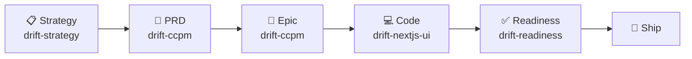

# /ship — Full Delivery Workflow

Orchestrate the complete delivery pipeline from business strategy through shipped code.

## Usage

```
/ship feature "notification system"
/ship bug "users can't login"
/ship chore "refactor auth middleware"
```

## What it does (in order)



### Phase 1: Strategy (drift-strategy)
- Define business model
- Identify ICP
- Plan GTM
- Set metrics

### Phase 2: Spec (drift-ccpm)
- Write PRD from your description
- Clarify requirements
- Define success metrics

### Phase 3: Plan (drift-ccpm)
- Parse PRD into Epic
- Decompose into GitHub Issues
- Map dependencies
- Create worktrees for parallel work

### Phase 4: Code (drift-nextjs-ui)
- Start working on issues
- Build components/pages
- Follow Next.js patterns

### Phase 5: Quality (drift-readiness)
- Audit code quality
- Check test coverage
- Verify CI passes
- Check bundle size

### Phase 6: Ship
- Merge to main
- Tag release
- Deploy
- Post standup

---

## Shorthand commands

**For features:**
```
/ship-feature "feature name"
```
Skips strategy, goes: PRD → Epic → Code → Deploy

**For bugs:**
```
/ship-bug "bug description"
```
Uses drift-rca first, then spec → fix → test

**For incidents:**
```
/ship-incident "what happened"
```
RCA → Postmortem → Fix → Deploy

**For quick checks:**
```
/standup
```
Runs drift-ccpm standup (what's done, in progress, blocked)

---

## Custom: Your workflow

Edit this file to reorder phases or add your own.
